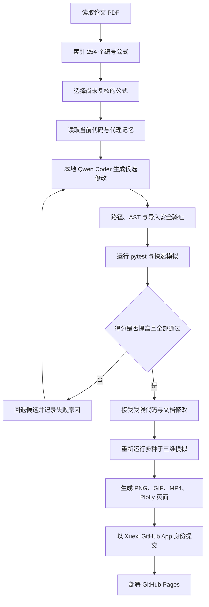

# 学习（Xuexi）：三维 Kakeya 自主研究代理

学习是一个在 GitHub Actions 中运行的本地代码模型代理。它围绕 Wang–Zahl 的论文《Volume estimates for unions of convex sets, and the Kakeya set conjecture in three dimensions》执行可审计的研究循环：读取论文、建立公式索引、检查模拟代码、生成受限候选修改、运行测试与数值实验、自我批评、回退不合格方案，并重新生成三维图像、动画、视频、交互式页面和研究文档。

> 本项目是有限分辨率数值研究工具，不是论文证明的替代品。代理不得把模拟结果描述成对 Kakeya 猜想的严格证明。

## 自主循环



## 代理真正会改变什么

代理可以在安全白名单内动态更新：

- `src/xuexi_agent/generated/strategy.py`：修改实验参数选择和研究假设；
- `src/xuexi_agent/generated/equation_extensions.py`：增加新的公式数值诊断；
- `docs/AI_RESEARCH_NOTE.md`：记录论文依据、自我批评和下一步；
- `docs/EQUATION_COVERAGE.md`：更新公式覆盖状态；
- `README.md`：在保持事实准确的前提下改进说明。

代理不能修改工作流、密钥逻辑、安全校验、论文 PDF 或测试基础设施。候选 Python 代码只能导入 `math`、`dataclasses`、`typing` 与 `numpy`，并且必须通过 AST 安全检查、单元测试和模拟评估。

## 数学对象与数值实现

程序把单位线段的 `δ` 邻域表示为三维胶囊管，并计算：

- 管并集与着色并集的体素体积；
- 点处重数、平均重数、中位重数和最大重数；
- Katz–Tao Convex Wolff 常数的随机凸长方体采样估计；
- Frostman Slab Wolff 常数的随机板采样估计；
- 细尺度与粗尺度重数分解；
- grain 尺度、方向 broadness 与局部密度；
- 管加倍及相关体积比；
- 论文 254 个编号公式的覆盖与诊断状态。

## 三维输出

每次被接受的代理周期都会重新生成：

```text
artifacts/latest/
├── preview.png
├── rotation.gif
├── rotation.mp4
├── viewer.html
├── metrics.json
├── formula_checks.csv
├── wolff_probes.csv
├── tubes.csv
└── random_log.md
```

网站位于 `site/`，可通过 GitHub Pages 发布。

## 本地运行

```bash
python -m pip install -e ".[dev,research]"
python -m pytest -q
python -m kakeya_sim \
  --mode mixed \
  --seed 250217655 \
  --tubes 48 \
  --delta 0.055 \
  --rho 0.24 \
  --resolution 40 \
  --output artifacts/latest \
  --site-output site
```

本地代理还需要 GGUF 模型和 `llama-cpp-python`：

```bash
python -m xuexi_agent agent \
  --model /path/to/qwen2.5-coder-3b-instruct-q4_k_m.gguf \
  --paper paper/2502.17655v1.pdf \
  --rounds 2
```

## 诚实边界

学习不会自动重新训练或微调模型权重。它是一个使用本地模型的自主软件代理：在受限目录中生成候选代码和文档，通过确定性测试与数值评分筛选后再决定是否接受。它可以逐轮扩展实验逻辑和公式诊断，但不能把证明链条中的每一个存在性论证机械地转化为可执行算法。
